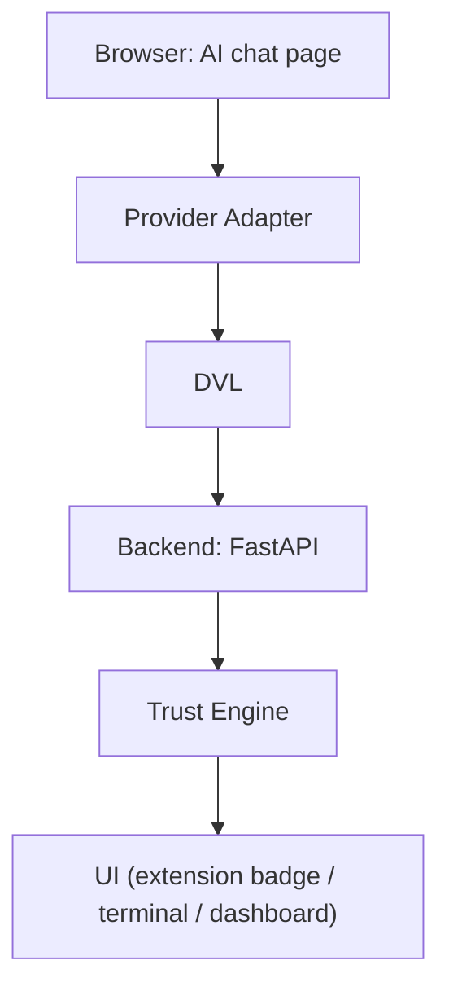
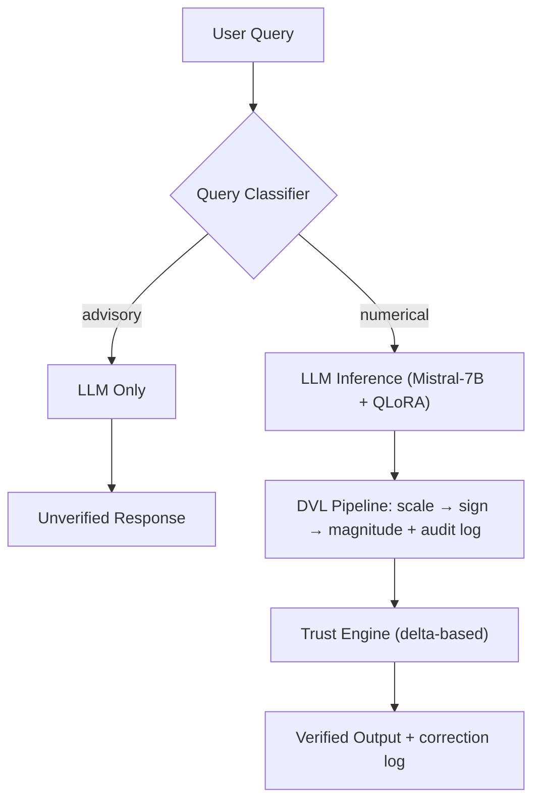

<div align="center">

<br />

# FinVerify

### The verification layer for financial AI.

Deterministic correction for AI-generated numbers — in the browser, in your backend, in your terminal.

<br />

[**Live Demo**](#) &nbsp;•&nbsp; [**Docs**](finverify-terminal/README.md) &nbsp;•&nbsp; [**Paper**](#) &nbsp;•&nbsp; [**Model**](https://huggingface.co/aadi2026/finverify-lora) &nbsp;•&nbsp; [**Discussions**](https://github.com/aadityat23/finverify-llm/discussions)

[](./LICENSE)
[](finverify-terminal/backend/requirements.txt)
[](finverify-terminal/frontend/package.json)
[](https://github.com/aadityat23/finverify-llm/actions/workflows/backend-tests.yml)
[](https://github.com/aadityat23/finverify-llm/actions/workflows/sdk-tests.yml)
[](./CONTRIBUTING.md)

<br />

**[Ecosystem](#finverify-ecosystem) · [Extension](#chrome-extension) · [SDK](#python-sdk) · [Benchmark](#benchmark) · [Features](#features) · [Architecture](#architecture) · [Quick Start](#quick-start) · [Results](#results) · [Research](#research) · [Contributing](#contributing)**

<br />

</div>

---

<div align="center">

| 🔒 Deterministic | 🧾 Auditable | 🌱 Open Source |
|:---:|:---:|:---:|
| Rule-based correction, not another model guess | Every correction logged — rule, input, output | Apache 2.0, actively developed, open to contributors |

</div>

---

## FinVerify Ecosystem

FinVerify isn't a single backend anymore — it's a monorepo of interoperable components that all share the same verification core (the DVL). Start here, then go deeper via each component's own README.

| Component | What it does |
|---|---|
| 🧩 [**finverify-extension**](finverify-extension) | Chrome extension providing inline financial verification inside AI chat UIs |
| 🖥 [**finverify-terminal**](finverify-terminal) | Backend services — REST API, WebSocket server — plus the terminal UI and market dashboard |
| 📦 [**finverify-sdk**](finverify-sdk) | Official Python SDK (`pip install finverify-sdk`) for integrating FinVerify into your own applications |
| 📊 [**finverify-bench**](finverify-bench) | Benchmark suite and evaluation harness for deterministic financial verification |
| 🔬 [**research**](research) | Papers, notebooks, experiments, and reproducibility assets |

New here? Jump to [Quick Start](#quick-start) to run any of these locally, or [Repository Structure](#repository-structure) for the full layout.

---

## Why FinVerify

> LLMs answering financial questions are often directionally right and numerically wrong — a decimal point misplaced, a percentage reported as a raw fraction, a sign flipped. In a regulated or capital-allocation context, that's not a rounding error. It's a liability.

Most fixes reach for more prompting. FinVerify reaches for a rule engine instead: the **Deterministic Verification Layer (DVL)**. Scale, sign, and magnitude errors are mechanically distinct from reasoning errors — they need a rule, not another model call.

<br />

| Traditional AI Workflow | FinVerify |
|---|---|
| Trust the output | Verify the output |
| Probabilistic | Deterministic |
| Hidden reasoning | Auditable corrections |
| Fix errors with better prompts | Fix errors with rules |
| Black box | Transparent, logged, reproducible |

<br />

**Built for**

| | |
|---|---|
| 🛠️ **Developers** | Shipping AI products that surface financial numbers and need an auditable correction layer |
| 🔬 **Researchers** | Studying numerical hallucination, who need a reproducible, ground-truth-free method |
| 📊 **Analysts** | Using AI chat assistants for financial analysis who want a deterministic second check |

---

<div align="center">

**Actively maintained** &nbsp;·&nbsp; **Apache 2.0** &nbsp;·&nbsp; **Discussions enabled** &nbsp;·&nbsp; **Extension in active development**

`TypeScript` `React` `Next.js` `Python` `FastAPI` `Mistral-7B (QLoRA)` `HuggingFace` `Playwright` `GitHub Actions`

</div>

---

## Chrome Extension

FinVerify's flagship surface. It verifies numbers in AI chat output inline, without leaving the page.

<div align="center">

<br />

**[ Screenshot — Chrome Extension Popup ]**

<sub>Default popup state, provider connected.</sub>

<br />

</div>

| Capability | Description |
|---|---|
| **Inline verification** | Numerical claims in a chat response run through the DVL as you read |
| **Trust badges** | Each verified number gets a HIGH / MEDIUM / LOW badge from the Trust Engine |
| **Verification report** | Expand a badge to see the correction rule, the original value, and the corrected value |
| **Provider Adapters** | New chat surfaces can be added without touching the DVL |

<div align="center">

<br />

**[ Screenshot — Inline Trust Badge ]**

<sub>A HIGH / MEDIUM / LOW badge rendered next to an AI chat answer.</sub>

<br />
<br />

**[ Screenshot — Verification Report ]**

<sub>Expanded badge showing the correction rule, original value, and corrected value.</sub>

<br />

</div>

Built as a monorepo workspace (`@finverify/core` shared package) with separate build targets: content and background scripts as IIFE bundles, popup as an ES module. Playwright end-to-end tests against local chat-UI fixtures are in progress, alongside the existing unit test suite.

---

## Python SDK

The official Python client for FinVerify — for developers who want DVL verification inside their own applications, without going through the extension or terminal UI.

```bash
pip install finverify-sdk
```

| Capability | Description |
|---|---|
| **Sync + async clients** | `FinVerify` and `AsyncFinVerify`, identical public surface |
| **Offline deterministic verification** | `verify_local()` runs the DVL correction rules in-process, no network call |
| **Batch verification** | Verify multiple claims in one call |
| **Typed models** | Dataclass response models, full type hints, `py.typed` marker |
| **Automatic retries** | Exponential backoff with jitter on 429/5xx, honoring `Retry-After` |

See [`finverify-sdk/README.md`](finverify-sdk/README.md) for the full API and [`finverify-sdk/CHANGELOG.md`](finverify-sdk/CHANGELOG.md) for release notes.

---

## Benchmark

[**finverify-bench**](finverify-bench) is the evaluation side of FinVerify: a benchmark suite and harness for measuring deterministic financial verification, independent of any single model.

- Reproducible evaluation harness for FinQA-derived and synthetic samples
- Ground-truth-blind DVL scoring — corrections never see the answer key
- Documented benchmark methodology in [`BENCHMARK_DESIGN.md`](finverify-bench/BENCHMARK_DESIGN.md)

See [`finverify-bench/README.md`](finverify-bench/README.md) to run the harness yourself.

---

## Features

| Category | Highlights |
|---|---|
| **Verification** | DVL — deterministic scale, sign, and magnitude correction · Financial Constraint Graph — accounting-identity checks · Trust Engine — delta-based confidence scoring |
| **Browser Extension** | Inline trust badges and verification reports · Provider Adapter architecture · Monorepo workspace |
| **Backend** | FastAPI REST + WebSocket API · Live market data verified through the DVL · SEC EDGAR & earnings-transcript ingestion · RAG pipeline (Pinecone + fallback) |
| **Research** | FinVerifyBench — synthetic diagnostic benchmark · Reproducible FinQA evaluation harness · Published ablation study |
| **Developer Experience** | Standalone SDK (`pip install finverify-sdk`) · Terminal UI · CI pipelines for backend and SDK |
| **Open Source** | Apache 2.0 · CONTRIBUTING guide, Code of Conduct, Security policy · Issues triaged by label |

---

## Architecture

**End-to-end**



**Backend detail — core v1 pipeline**



> **Why it matters** — every surface (extension, terminal, API) calls the same DVL. Verification logic lives in one place, not reimplemented per surface.

This intentionally omits the Financial Constraint Graph, ingestion, and RAG subsystems — see [Repository Structure](#repository-structure) for those.

---

## Quick Start

<table>
<tr><td width="50%" valign="top">

### 🖥 Backend
Runs the FastAPI verification service.

```bash
git clone https://github.com/aadityat23/finverify-llm.git
cd finverify-llm/finverify-terminal/backend
python -m venv venv
source venv/bin/activate
pip install -r requirements.txt
cp .env.example .env        # fill in HF_TOKEN
uvicorn app.main:app --reload --port 8000
```

</td><td width="50%" valign="top">

### 🖼 Frontend
Runs the terminal and market dashboard UI.

```bash
cd finverify-llm/finverify-terminal/frontend
npm install
cp .env.local.example .env.local
npm run dev    # http://localhost:3000
```

</td></tr>
<tr><td width="50%" valign="top">

### 📦 SDK
Installs the standalone Python SDK for local, offline verification.

```bash
pip install finverify-sdk
```

For local development against this repo instead:

```bash
cd finverify-llm/finverify-sdk
pip install -e ".[dev]"
```

See [`finverify-sdk/README.md`](finverify-sdk/README.md) to use it against a hosted API instead of local, offline verification.

</td><td width="50%" valign="top">

### 🧩 Chrome Extension
Builds the browser extension for inline verification.

```bash
cd finverify-llm/finverify-extension
npm install
npm run build
```

Load it via `chrome://extensions` → **Load unpacked**.

</td></tr>
</table>

**Verify the backend is running:**

```bash
curl http://localhost:8000/health

curl -X POST http://localhost:8000/verify \
  -H "Content-Type: application/json" \
  -d '{"question": "What was the profit margin?", "raw_number": 0.1240}'

curl http://localhost:8000/market/quotes?symbols=AAPL,TSLA
```

---

## Showcase

<div align="center">

<br />

**[ Screenshot — Terminal ]**

<sub>Query flow in the terminal-style UI.</sub>

<br />
<br />

**[ Screenshot — Market Dashboard ]**

<sub>Watchlist with verified metric cards and sparklines.</sub>

<br />

</div>

> Screenshots are an open contribution — see [Contributing](#contributing).

---

## Results

FinQA dev set, n=873, 95% bootstrap CI:

| Configuration | Accuracy | 95% CI | Δ |
|---|---|---|---|
| Baseline (no context) | 1.00% | [0.4, 1.9] | — |
| +Document Context | 24.00% | [21.2, 26.9] | +23.0pp |
| +DVL v1 | 32.00% | [29.0, 35.1] | +8.0pp |
| +QLoRA Fine-tuning | 38.50% | [35.4, 41.7] | +6.5pp |
| **+DVL v2 (final)** | **42.61%** | **[39.5, 45.7]** | **+4.1pp** |

Negative results: CoT prompting −9.0pp, CoT fine-tuning −12.0pp, cross-doc RAG −7.5pp.

> At 42.61%, this is 5.4pp behind GPT-3.5 (no CoT, 48.0%) — using a model 25x smaller, no proprietary compute, and fully deterministic, auditable output.
>
> The DVL only fires on formatting-level errors, not reasoning errors — see the error taxonomy below.

### Error taxonomy (n=539 remaining failures)

| Error type | Count | % |
|---|---|---|
| Reasoning (close, <50% rel.) | 210 | 39.0% |
| Reasoning (far, >50% rel.) | 184 | 34.1% |
| Magnitude | 66 | 12.2% |
| Order-of-magnitude | 62 | 11.4% |
| Sign | 9 | 1.6% |
| Scale | 4 | 0.8% |

73.1% of remaining failures are reasoning errors, not correctable by the DVL. 0% are formatting or extraction failures after fine-tuning.

---

## Repository Structure

```
finverify-llm/
├── README.md                    # this file
├── docs/                        # cross-component documentation, images
├── artifacts/                   # build artifacts, exported reports
├── finverify-extension/         # Chrome Extension (monorepo)
│   ├── packages/
│   │   └── core/                 # @finverify/core — shared verification client
│   ├── content/                  # content script (IIFE build)
│   ├── background/                # background script (IIFE build)
│   └── popup/                    # popup UI (ESM build)
├── finverify-terminal/           # backend services + terminal/dashboard UI
│   ├── backend/
│   │   ├── app/
│   │   │   ├── main.py          # FastAPI app and route definitions
│   │   │   ├── dvl.py           # Deterministic Verification Layer
│   │   │   ├── router.py        # numerical vs advisory query classifier
│   │   │   ├── parser.py        # numeric extraction from LLM text
│   │   │   ├── market.py        # yfinance wrapper, DVL-verified metrics
│   │   │   └── models.py        # request/response schemas
│   │   ├── fcg/                 # Financial Constraint Graph, metric normalizer
│   │   ├── ingestion/           # SEC EDGAR and earnings-transcript ingestion
│   │   ├── rag/                 # retrieval pipeline (Pinecone + fallback search)
│   │   └── evals/               # cross-model evaluation harness
│   └── frontend/
│       ├── app/                 # Next.js pages: terminal, market, metrics
│       ├── components/          # TrustScore, DVLReport, VerificationLog, etc.
│       └── lib/                 # API client, offline DVL fallback, history
├── finverify-sdk/                # standalone `pip install finverify-sdk` package
│   └── finverify/                # SDK source — sync/async clients, typed models
├── finverify-bench/               # benchmark suite and evaluation harness
│   ├── BENCHMARK_DESIGN.md        # methodology and construction notes
│   └── DVL_mapping/               # ground-truth-blind DVL evaluation mapping
└── research/                     # papers, notebooks, experiments, reproducibility assets
```

<details>
<summary><b>Component reference</b> (click to expand)</summary>

<br />

| Component | Path | Purpose |
|---|---|---|
| Chrome Extension core | `finverify-extension/packages/core` | Shared verification client used across content/background/popup |
| DVL engine | `backend/app/dvl.py` | Scale/sign/magnitude correction with audit logging |
| Query classifier | `backend/app/router.py` | Routes numerical vs advisory queries |
| Market layer | `backend/app/market.py` | Live yfinance data, DVL-verified financial metrics |
| Financial Constraint Graph | `backend/fcg/constraint_engine.py` | Multi-number accounting-identity and ratio-bound checks |
| SEC EDGAR ingestion | `backend/ingestion/sec_edgar.py` | XBRL/fallback ingestion of 10-K/10-Q fundamentals |
| Earnings transcript verification | `backend/ingestion/transcripts.py` | Regex extraction and DVL verification of earnings-call claims |
| RAG pipeline | `backend/rag/pipeline.py` | Pinecone vector + keyword-overlap fallback retrieval |
| WebSocket server | `backend/app/main.py` | Real-time market data push (5s interval) |
| Terminal UI | `frontend/app/page.tsx` | Terminal-style query interface, three-panel layout |
| Market mode | `frontend/app/market/page.tsx` | Live watchlist, verified metric cards, sparklines |
| Metrics dashboard | `frontend/app/metrics/page.tsx` | Paper results, ablation study, error taxonomy |
| Python SDK | `finverify-sdk/finverify/` | Sync/async client, typed models, `verify_local()` offline mode |
| Benchmark suite | `finverify-bench/` | FinVerifyBench dataset, DVL evaluation mapping, design docs |

</details>

---

## API Reference

| Method | Path | Description |
|---|---|---|
| POST | `/query` | LLM inference + DVL verification |
| POST | `/verify` | DVL-only verification, no LLM call |
| GET | `/health` | Health check |
| GET | `/market/quotes?symbols=AAPL,TSLA` | Live stock quotes |
| GET | `/market/indices` | S&P 500, NASDAQ, VIX |
| GET | `/market/verified-metrics?symbol=AAPL&metric=profit_margin` | DVL-verified metric |
| GET | `/market/all-metrics?symbol=AAPL` | All five metrics for a symbol |
| POST, GET | `/v1/fcg/*` | FCG endpoints: verify, normalize, list constraints |
| POST, GET | `/v1/rag/*` | RAG endpoints: query, stats, seed |
| GET, POST, DELETE | `/v1/history/*` | User query-history persistence |
| WS | `/ws/market` | Real-time market data stream |

`/v1/fundamentals/{ticker}`, `/v1/earnings/{ticker}`, and `/v1/ingest/*` are also exposed, for on-demand SEC and transcript ingestion. Endpoint-by-endpoint documentation is an open contribution — see [Contributing](#contributing).

---

## Research

| | |
|---|---|
| **Paper** | *Modular Verification Outperforms Chain-of-Thought Reasoning in Small Financial LLMs: A Systematic Ablation Study on Numerical Hallucination Reduction* |
| **Submitted to** | FinNLP @ EMNLP 2026 / IEEE Access |
| **Author** | Aaditya Thokal, Universal College of Engineering, Mumbai — [aaditya.thokal24@gmail.com](mailto:aaditya.thokal24@gmail.com) |
| **Model** | [aadi2026/finverify-lora](https://huggingface.co/aadi2026/finverify-lora) — Mistral-7B + QLoRA, trained on 2,000 FinQA examples |
| **Dataset** | [FinQA](https://finqasite.github.io/) dev set (n=873); FinVerifyBench isolates formatting-level errors from reasoning errors |

---

## Roadmap

Tracked through GitHub Milestones — here's where things stand, and where help is most useful.

<table>
<tr><td valign="top">

**Core Infrastructure**
- ✅ FastAPI backend, WebSocket market stream
- ✅ CI pipelines for backend and SDK
- 🔧 API stability & docs for ingestion routes

</td><td valign="top">

**Verification Engine**
- ✅ DVL, Financial Constraint Graph, Trust Engine
- 🔧 Consolidating the DVL
- 📋 Verification methods beyond scale/sign/magnitude

</td></tr>
<tr><td valign="top">

**Browser Extension**
- ✅ Core, monorepo restructure, Provider Adapters
- 🔧 Playwright E2E against chat-UI fixtures
- 📋 Additional Provider Adapters

</td><td valign="top">

**Developer Experience & Research**
- ✅ Standalone SDK, Terminal UI
- 🔧 Expanding backend test coverage
- 📋 Broader model evaluation, deployment tooling

</td></tr>
</table>

`✅ Completed` `🔧 In progress` `📋 Planned`

---

## Contributing

FinVerify is a young project with a lot of open surface area — there's a meaningful way to contribute regardless of your background.

Start with [CONTRIBUTING.md](./CONTRIBUTING.md) for setup and workflow, and [CODE_OF_CONDUCT.md](./CODE_OF_CONDUCT.md) for community guidelines.

| Label | Good for |
|---|---|
| `good first issue` | Self-contained, no deep internals required |
| `help wanted` | Open tasks looking for a contributor |
| `research` | Benchmark design, ablations, evaluation methodology |
| `backend` | FastAPI, DVL, ingestion, RAG |
| `frontend` | Next.js terminal and dashboard |
| `extension` | Chrome Extension, Provider Adapters, Playwright E2E |
| `documentation` | Endpoint docs, guides, screenshots |

> First open-source contribution? `good first issue` is the place to start.

---

## Community

| | |
|---|---|
| 🌐 Website | [Live Demo](#) |
| 💬 Discussions | [GitHub Discussions](https://github.com/aadityat23/finverify-llm/discussions) — design questions, feedback, "is this worth doing" conversations |
| 🐛 Issues | [GitHub Issues](https://github.com/aadityat23/finverify-llm/issues) — bugs and tracked work |
| 📄 Contributing guide | [CONTRIBUTING.md](./CONTRIBUTING.md) |
| 👥 Contributors | [CONTRIBUTORS.md](CONTRIBUTORS.md) |

FinVerify was created and is maintained by [Aaditya Thokal](mailto:aaditya.thokal24@gmail.com), Universal College of Engineering, Mumbai.

---

## License

Apache License 2.0 — see [LICENSE](./LICENSE).

<br />

<div align="center">

**If FinVerify is useful to you, consider starring the repository. ⭐**

</div>
