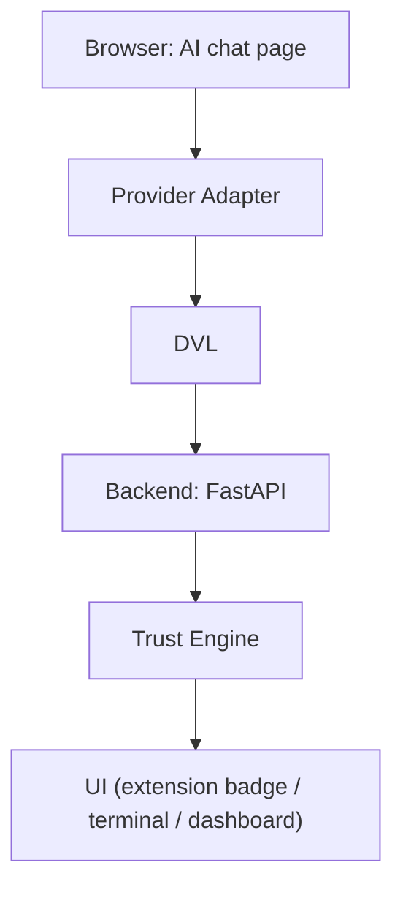
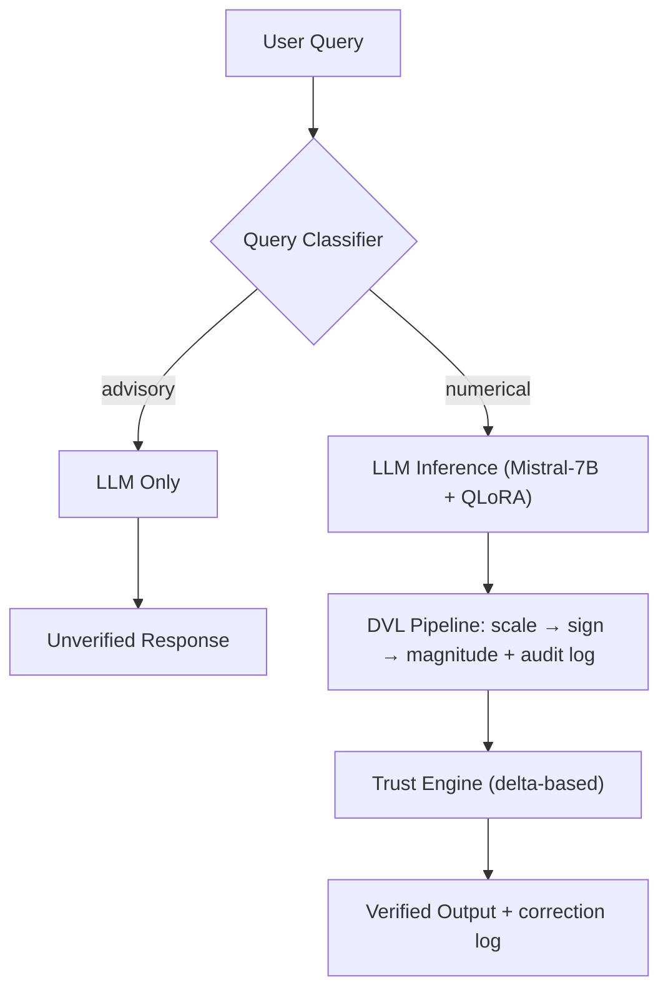

<div align="center">

# FinVerify

### The verification layer for financial AI.

FinVerify catches scale, sign, and magnitude errors in AI-generated numbers and corrects them with a deterministic, auditable rule engine — in the browser, in your backend, and in your terminal.

[Live Demo](#) · [Docs](finverify-terminal/README.md) · [Paper](#) · [Model on HF](https://huggingface.co/aadi2026/finverify-lora) · [Discussions](https://github.com/aadityat23/finverify-llm/discussions)

[](./LICENSE)
[](finverify-terminal/backend/requirements.txt)
[](finverify-terminal/frontend/package.json)
[](https://github.com/aadityat23/finverify-llm/actions/workflows/backend-tests.yml)
[](https://github.com/aadityat23/finverify-llm/actions/workflows/sdk-tests.yml)
[](./CONTRIBUTING.md)

</div>

---

## Table of Contents

- [Why FinVerify](#why-finverify)
- [Current Status](#current-status)
- [Built With](#built-with)
- [Chrome Extension](#chrome-extension)
- [Features](#features)
- [Showcase](#showcase)
- [Architecture](#architecture)
- [Quick Start](#quick-start)
- [Results](#results)
- [Benchmarks](#benchmarks)
- [Repository Structure](#repository-structure)
- [API Reference](#api-reference)
- [Research](#research)
- [Roadmap](#roadmap)
- [Contributing](#contributing)
- [Community](#community)
- [License](#license)

---

## Why FinVerify

LLMs answering financial questions are often directionally right and numerically wrong — a decimal point misplaced, a percentage reported as a raw fraction, a sign flipped. In a regulated or capital-allocation context, that's not a rounding error. It's a liability.

Most fixes reach for more prompting: chain-of-thought, more context, bigger models. FinVerify reaches for a rule engine instead: the **Deterministic Verification Layer (DVL)**. Scale, sign, and magnitude errors are mechanically distinct from reasoning errors. They don't need another model call to fix — they need a rule.

| Traditional AI Workflow | FinVerify |
|---|---|
| Trust the output | Verify the output |
| Probabilistic | Deterministic |
| Hidden reasoning | Auditable corrections |
| Fix errors with better prompts | Fix errors with rules |
| Black box | Transparent, logged, reproducible |

**Who it's for**

- Developers shipping AI products that surface financial numbers and need an auditable correction layer
- Researchers studying numerical hallucination who need a reproducible, ground-truth-free verification method
- Anyone using AI chat assistants for financial analysis who wants a deterministic second check before acting on the numbers

## Current Status

- Actively maintained, single maintainer, open to contributors
- Apache 2.0 licensed
- GitHub Discussions enabled for design questions and feedback
- Backend, SDK, and Terminal UI stable, with CI-covered test suites
- Chrome Extension under active development

## Built With

`TypeScript` · `React` · `Next.js` · `Python` · `FastAPI` · `Mistral-7B (QLoRA)` · `HuggingFace` · `Playwright` · `GitHub Actions`

## Chrome Extension

FinVerify's flagship surface. It verifies numbers in AI chat output inline, without leaving the page.

| Capability | Description |
|---|---|
| **Inline verification** | Numerical claims in a chat response run through the DVL as you read |
| **Trust badges** | Each verified number gets a HIGH / MEDIUM / LOW badge from the Trust Engine |
| **Verification report** | Expand a badge to see the correction rule, the original value, and the corrected value |
| **Provider Adapters** | New chat surfaces can be added without touching the DVL |

Built as a monorepo workspace (`@finverify/core` shared package) with separate build targets: content and background scripts as IIFE bundles, popup as an ES module. Playwright end-to-end tests against local chat-UI fixtures are in progress, alongside the existing unit test suite.

See [Architecture](#architecture) for how a claim flows from the page to a badge.

## Features

**Verification**
- DVL — deterministic scale, sign, and magnitude correction with per-correction audit logging
- Financial Constraint Graph — accounting-identity and ratio-bound checks across multiple figures
- Trust Engine — HIGH / MEDIUM / LOW confidence from relative delta, not just a correction count

**Browser Extension**
- Inline trust badges and verification reports on AI chat output
- Provider Adapter architecture, monorepo workspace

**Backend**
- FastAPI REST + WebSocket API
- Live market data (Yahoo Finance) verified through the DVL
- SEC EDGAR and earnings-transcript ingestion
- RAG pipeline (Pinecone + keyword-overlap fallback)

**Research**
- FinVerifyBench — synthetic diagnostic benchmark isolating formatting errors from reasoning errors
- Reproducible FinQA evaluation harness and published ablation study

**Developer Experience**
- Standalone SDK (`pip install finverify`) for offline, local verification
- Terminal UI for direct query/verify interaction
- CI pipelines for backend and SDK test suites

**Open Source**
- Apache 2.0, CONTRIBUTING guide, Code of Conduct, Security policy
- Issues triaged with `good first issue`, `help wanted`, `advanced`, `research`

## Showcase

> An open contribution — see [Contributing](#contributing). Each slot names exactly what's needed.

| Slot | What to capture |
|---|---|
| Chrome Extension Popup | Default popup state, provider connected |
| Inline Trust Badge | A HIGH/MEDIUM/LOW badge rendered next to an AI chat answer |
| Verification Report | Expanded badge showing rule, original value, corrected value |
| Terminal | Query flow in the terminal-style UI |
| Market Dashboard | Watchlist with verified metric cards and sparklines |

## Architecture

**End-to-end**



**Backend detail — core v1 pipeline**



This intentionally omits the Financial Constraint Graph, ingestion, and RAG subsystems — see [Repository Structure](#repository-structure) for those.

## Quick Start

### Backend
Runs the FastAPI verification service.

```bash
git clone https://github.com/aadityat23/finverify-llm.git
cd finverify-llm/finverify-terminal/backend
python -m venv venv
source venv/bin/activate    # Windows: venv\Scripts\activate
pip install -r requirements.txt
cp .env.example .env        # fill in HF_TOKEN
uvicorn app.main:app --reload --port 8000
```

```bash
curl http://localhost:8000/health

curl -X POST http://localhost:8000/verify \
  -H "Content-Type: application/json" \
  -d '{"question": "What was the profit margin?", "raw_number": 0.1240}'

curl http://localhost:8000/market/quotes?symbols=AAPL,TSLA
```

### Frontend
Runs the terminal and market dashboard UI.

```bash
cd finverify-llm/finverify-terminal/frontend
npm install
cp .env.local.example .env.local    # adjust API_URL if needed
npm run dev                          # http://localhost:3000
```

### SDK
Installs the standalone Python SDK for local, offline verification.

```bash
cd finverify-llm/finverify-terminal/sdk
pip install -e .
```

See `sdk/README.md` for usage against a hosted API instead.

### Chrome Extension
Builds the browser extension for inline verification.

```bash
cd finverify-llm/finverify-extension
npm install
npm run build
```

Load the build output as an unpacked extension via `chrome://extensions` → **Load unpacked**.

## Results

FinQA dev set, n=873, 95% bootstrap CI:

| Configuration | Accuracy | 95% CI | Δ |
|---|---|---|---|
| Baseline (no context) | 1.00% | [0.4, 1.9] | — |
| +Document Context | 24.00% | [21.2, 26.9] | +23.0pp |
| +DVL v1 | 32.00% | [29.0, 35.1] | +8.0pp |
| +QLoRA Fine-tuning | 38.50% | [35.4, 41.7] | +6.5pp |
| **+DVL v2 (final)** | **42.61%** | **[39.5, 45.7]** | **+4.1pp** |

Negative results: CoT prompting −9.0pp, CoT fine-tuning −12.0pp, cross-doc RAG −7.5pp.

At 42.61%, this is 5.4pp behind GPT-3.5 (no CoT, 48.0%), using a model 25x smaller, no proprietary compute, and fully deterministic, auditable output.

> The DVL only fires on formatting-level errors, not reasoning errors — see the [error taxonomy](#benchmarks) below.

## Benchmarks

### Error taxonomy (n=539 remaining failures)

| Error type | Count | % |
|---|---|---|
| Reasoning (close, <50% rel.) | 210 | 39.0% |
| Reasoning (far, >50% rel.) | 184 | 34.1% |
| Magnitude | 66 | 12.2% |
| Order-of-magnitude | 62 | 11.4% |
| Sign | 9 | 1.6% |
| Scale | 4 | 0.8% |

73.1% of remaining failures are reasoning errors, not correctable by the DVL. 0% are formatting or extraction failures after fine-tuning.

## Repository Structure

```
finverify-llm/
├── README.md                    # this file
├── *.ipynb                      # research notebooks (FinQA experiments)
├── *.pdf                        # paper drafts and supplementary material
├── finverify-extension/         # Chrome Extension (monorepo)
│   ├── packages/
│   │   └── core/                 # @finverify/core — shared verification client
│   ├── content/                  # content script (IIFE build)
│   ├── background/                # background script (IIFE build)
│   └── popup/                    # popup UI (ESM build)
└── finverify-terminal/
    ├── backend/
    │   ├── app/
    │   │   ├── main.py          # FastAPI app and route definitions
    │   │   ├── dvl.py           # Deterministic Verification Layer
    │   │   ├── router.py        # numerical vs advisory query classifier
    │   │   ├── parser.py        # numeric extraction from LLM text
    │   │   ├── market.py        # yfinance wrapper, DVL-verified metrics
    │   │   └── models.py        # request/response schemas
    │   ├── fcg/                 # Financial Constraint Graph, metric normalizer
    │   ├── ingestion/           # SEC EDGAR and earnings-transcript ingestion
    │   ├── rag/                 # retrieval pipeline (Pinecone + fallback search)
    │   └── evals/               # cross-model evaluation harness
    ├── frontend/
    │   ├── app/                 # Next.js pages: terminal, market, metrics
    │   ├── components/          # TrustScore, DVLReport, VerificationLog, etc.
    │   └── lib/                 # API client, offline DVL fallback, history
    └── sdk/
        └── finverify/           # standalone `pip install finverify` package
```

| Component | Path | Purpose |
|---|---|---|
| Chrome Extension core | `finverify-extension/packages/core` | Shared verification client used across content/background/popup |
| DVL engine | `backend/app/dvl.py` | Scale/sign/magnitude correction with audit logging |
| Query classifier | `backend/app/router.py` | Routes numerical vs advisory queries |
| Market layer | `backend/app/market.py` | Live yfinance data, DVL-verified financial metrics |
| Financial Constraint Graph | `backend/fcg/constraint_engine.py` | Multi-number accounting-identity and ratio-bound checks |
| SEC EDGAR ingestion | `backend/ingestion/sec_edgar.py` | XBRL/fallback ingestion of 10-K/10-Q fundamentals |
| Earnings transcript verification | `backend/ingestion/transcripts.py` | Regex extraction and DVL verification of earnings-call claims |
| RAG pipeline | `backend/rag/pipeline.py` | Pinecone vector + keyword-overlap fallback retrieval |
| WebSocket server | `backend/app/main.py` | Real-time market data push (5s interval) |
| Terminal UI | `frontend/app/page.tsx` | Terminal-style query interface, three-panel layout |
| Market mode | `frontend/app/market/page.tsx` | Live watchlist, verified metric cards, sparklines |
| Metrics dashboard | `frontend/app/metrics/page.tsx` | Paper results, ablation study, error taxonomy |

## API Reference

| Method | Path | Description |
|---|---|---|
| POST | `/query` | LLM inference + DVL verification |
| POST | `/verify` | DVL-only verification, no LLM call |
| GET | `/health` | Health check |
| GET | `/market/quotes?symbols=AAPL,TSLA` | Live stock quotes |
| GET | `/market/indices` | S&P 500, NASDAQ, VIX |
| GET | `/market/verified-metrics?symbol=AAPL&metric=profit_margin` | DVL-verified metric |
| GET | `/market/all-metrics?symbol=AAPL` | All five metrics for a symbol |
| POST, GET | `/v1/fcg/*` | FCG endpoints: verify, normalize, list constraints |
| POST, GET | `/v1/rag/*` | RAG endpoints: query, stats, seed |
| GET, POST, DELETE | `/v1/history/*` | User query-history persistence |
| WS | `/ws/market` | Real-time market data stream |

`/v1/fundamentals/{ticker}`, `/v1/earnings/{ticker}`, and `/v1/ingest/*` are also exposed, for on-demand SEC and transcript ingestion. Endpoint-by-endpoint documentation for these is an open contribution — see [Contributing](#contributing).

## Research

**Paper** — *Modular Verification Outperforms Chain-of-Thought Reasoning in Small Financial LLMs: A Systematic Ablation Study on Numerical Hallucination Reduction*

**Submitted to** — FinNLP @ EMNLP 2026 / IEEE Access

**Author** — Aaditya Thokal, Universal College of Engineering, Mumbai — [aaditya.thokal24@gmail.com](mailto:aaditya.thokal24@gmail.com)

**Model** — [aadi2026/finverify-lora](https://huggingface.co/aadi2026/finverify-lora), Mistral-7B + QLoRA, trained on 2,000 FinQA examples

**Dataset** — evaluated on the [FinQA](https://finqasite.github.io/) dev set (n=873). FinVerifyBench, a synthetic diagnostic benchmark, isolates formatting-level errors from reasoning errors.

## Roadmap

Tracked through GitHub Milestones.

**Core Infrastructure**
- ✅ FastAPI backend, WebSocket market stream
- ✅ CI pipelines for backend and SDK
- 🔧 API stability and documentation for ingestion routes

**Verification Engine**
- ✅ DVL (scale / sign / magnitude), Financial Constraint Graph, Trust Engine
- 🔧 Consolidating the DVL
- 📋 Additional verification methods beyond scale/sign/magnitude

**Browser Extension**
- ✅ Core, monorepo restructure, Provider Adapter architecture
- 🔧 Playwright end-to-end coverage against chat-UI fixtures
- 📋 Additional Provider Adapters

**Developer Experience**
- ✅ Standalone SDK, Terminal UI
- 🔧 Expanding automated test coverage across the backend

**Future Research**
- 📋 Broader model evaluation
- 📋 Improved deployment tooling

✅ Completed · 🔧 In progress · 📋 Planned

## Contributing

Start with [CONTRIBUTING.md](./CONTRIBUTING.md) for setup, workflow, and coding standards, and read the [Code of Conduct](./CODE_OF_CONDUCT.md).

| Label | Good for |
|---|---|
| `good first issue` | Self-contained, no deep internals required |
| `help wanted` | Open tasks looking for a contributor |
| `research` | Benchmark design, ablations, evaluation methodology |
| `backend` | FastAPI, DVL, ingestion, RAG |
| `frontend` | Next.js terminal and dashboard |
| `extension` | Chrome Extension, Provider Adapters, Playwright E2E |
| `documentation` | Endpoint docs, guides, screenshots |

## Community

| | |
|---|---|
| Website | [Live Demo](#) |
| Discussions | [GitHub Discussions](https://github.com/aadityat23/finverify-llm/discussions) — design questions, feedback, "is this worth doing" conversations |
| Issues | [GitHub Issues](https://github.com/aadityat23/finverify-llm/issues) — bugs and tracked work |
| Contributing guide | [CONTRIBUTING.md](./CONTRIBUTING.md) |
| Contributors | [CONTRIBUTORS.md](CONTRIBUTORS.md) |

FinVerify was created and is currently maintained by [Aaditya Thokal](mailto:aaditya.thokal24@gmail.com), Universal College of Engineering, Mumbai.

## License

Apache License 2.0. See [LICENSE](./LICENSE).

---

<div align="center">

If FinVerify is useful to you, consider starring the repository.

</div>
