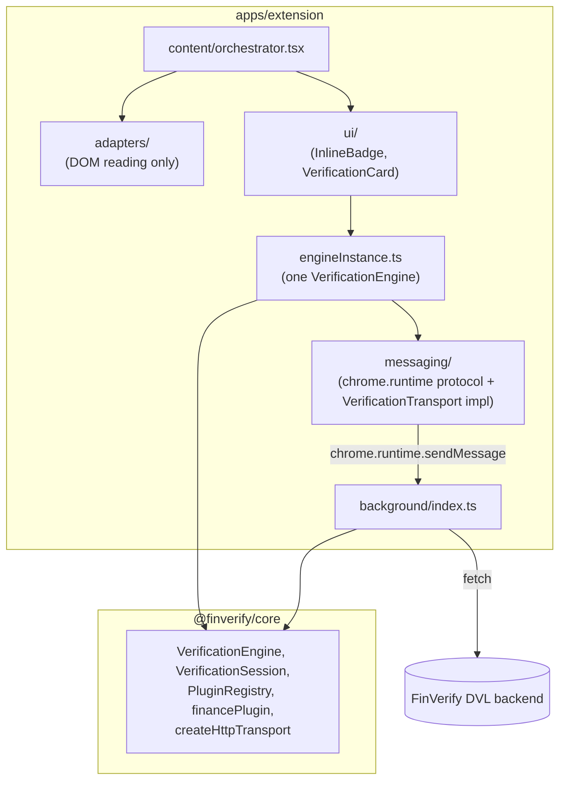
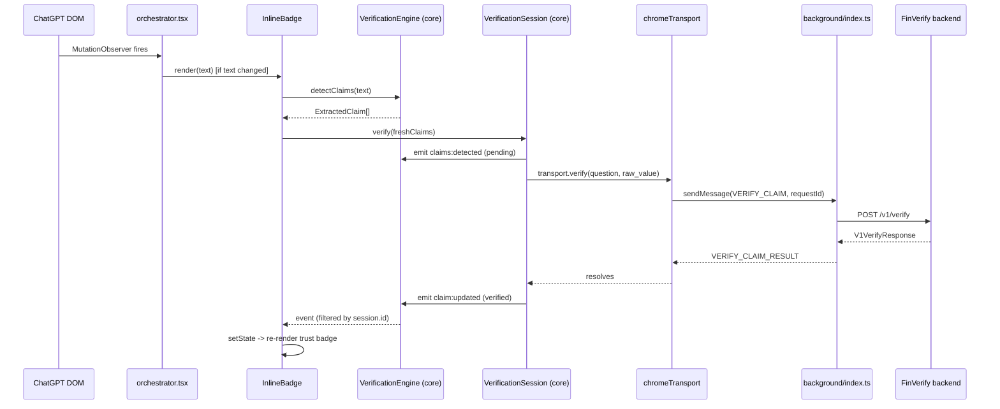

# Extension Architecture

This describes the *extension's* internal structure. For the verification
engine itself (event system, plugin contract, transport abstraction,
batching/dedup/cancellation/retry), see `packages/core/README.md` — this
app no longer contains any of that logic; it consumes it.

## Layers



```
adapters/     — reads a specific AI product's DOM. Nothing else.
messaging/    — chrome.runtime protocol + the extension's one
                VerificationTransport implementation (chromeTransport.ts).
ui/           — React components. Takes @finverify/core's VerifiedClaim
                objects in as props, renders them. Never calls the
                network or the engine directly except via the shared
                engine instance for session creation/event subscription.
content/      — orchestrator. Imports adapters/, ui/, and the shared
                engine instance (engineInstance.ts) — the one place that
                wires all three together.
background/   — service worker. Owns requestId -> AbortController
                bookkeeping for CANCEL_CLAIM; delegates all retry/backoff/
                timeout logic to @finverify/core's createHttpTransport.
engineInstance.ts — the extension's entire integration point with
                @finverify/core: one VerificationEngine, configured with
                chromeTransport + financePlugin.
```

The dependency direction is one-way: `content` depends on `adapters`,
`ui`, and `engineInstance`; `ui` depends on `engineInstance` (to create
sessions / subscribe to events) and on `@finverify/core`'s types, but
never on `adapters`. `messaging` depends on nothing extension-specific
beyond the chrome APIs themselves.

## Provider adapters

See `adapters/types.ts` for the full interface contract. Only `chatgpt` is
`verified: true` today. Claude, Gemini, Copilot, and Perplexity exist as
inert stubs. See `docs/adding-a-provider.md` before touching any of them.

## How this app talks to @finverify/core

```
ChatGPT DOM
  → adapters/chatgpt (reads text + streaming state)
  → content/orchestrator.tsx (tracks message → React root)
  → ui/InlineBadge (diffs new claims via engine.detectClaims(text),
                     creates a session via engine.createSession(),
                     calls session.verify(freshClaims),
                     subscribes to engine.on(...) filtered by session.id)
  → engineInstance.ts's shared `engine` (a @finverify/core VerificationEngine)
  → messaging/chromeTransport.ts (implements VerificationTransport by
                     sending requestId-tagged messages)
  → background/index.ts (owns AbortControllers per requestId, calls
                     @finverify/core's createHttpTransport directly)
  → FinVerify backend (POST /v1/verify)
  → … events flow back up through the engine's bus to InlineBadge's state
```

Everything above the `engineInstance.ts` line used to be the entire
verification engine (claim regexes, trust palette, retry/backoff, dedup,
batching, cancellation) living directly in this app. All of it moved to
`@finverify/core`; this app's job now is exactly three things: read the
DOM, transport bytes to/from the background worker, and render whatever
the engine's events say.

## Lifecycle of one message

1. Orchestrator's `MutationObserver` fires (or the 4s safety-net interval).
2. `adapter.findMessages()` surfaces it; if not yet tracked, a container is
   mounted (into the real toolbar if `findToolbar()` finds one yet, else a
   fallback mount point) and an `InlineBadge` React root is created.
3. On every subsequent scan, if `adapter.extractText()` differs from what
   was last rendered, the badge re-renders with the new text.
4. `InlineBadge` diffs newly-appeared claims (via
   `engine.detectClaims(text)`) against ones it's already seen and calls
   `session.verify()` with only the new ones.
5. If the badge was mounted to a fallback point (message was still
   streaming when first seen) and a real toolbar appears later, the
   container `<span>` is moved into it — this preserves the React root
   and the session's in-flight state.
6. When the message leaves the DOM, the orchestrator's prune pass unmounts
   its React root, which triggers `InlineBadge`'s cleanup effect, which
   calls `session.cancel()` — cancelling every request that session
   started (see `packages/core`'s dedup-ownership rules for why a
   cancelled session never accidentally kills a request another
   message's session is also waiting on).

## Sequence: one verification round-trip


