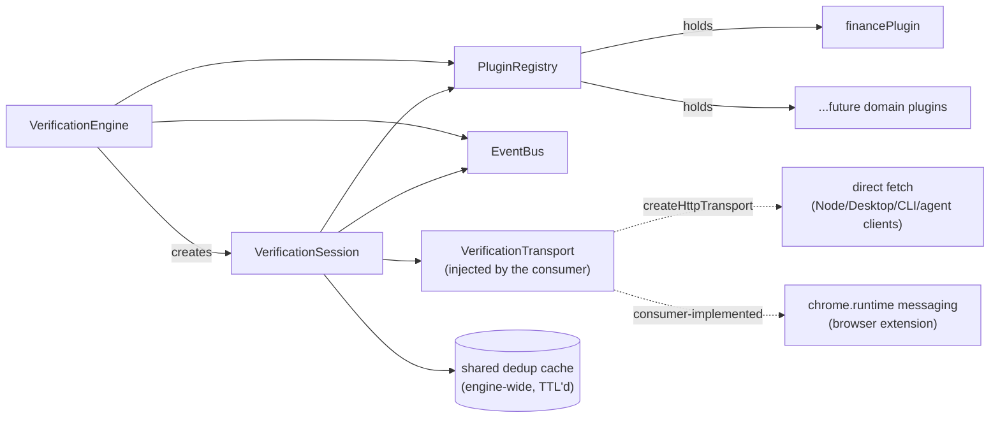

# @finverify/core

Provider-agnostic, event-driven, plugin-based verification engine. This
package has no DOM dependency, no `chrome.*` API usage, and no React —
it runs anywhere Node or a browser's `fetch`/`AbortController` exist,
which is the whole point: the same engine is meant to sit underneath
the Chrome Extension, a future VS Code extension, a Desktop app, an
Enterprise Dashboard, and AI agent integrations alike.

Full generated API reference (every exported class/interface/type, pulled
straight from source doc comments — never hand-copied out of sync):
run `npm run docs:api` in this package, then open `docs/api/README.md`.

## Internal structure



## The three seams that make "thin client" real

1. **`VerificationTransport`** — how the engine reaches a verification
   backend. The engine calls `transport.verify(request, {signal})` and
   nothing else; it has no idea whether that's a direct `fetch` (the
   built-in `createHttpTransport`, usable as-is by any Node-based client)
   or proxied through `chrome.runtime.sendMessage` (the extension's own
   `createChromeTransport`, which lives in the extension app, not here).

2. **`VerifierPlugin`** — how the engine finds domain-specific claims and
   turns them into a verification question. The engine's `PluginRegistry`
   only ever calls `plugin.detectClaims(text)` and
   `plugin.buildQuestion(claim)`; it has no finance-specific (or
   healthcare-specific, or legal-specific) logic anywhere in
   `engine.ts`/`session.ts`. See "Adding a domain plugin" below.

3. **`EngineEvent`** — how a consumer finds out what happened. The engine
   never returns "the answer" from a single call; it emits
   `claims:detected` → one or more `claim:updated` → `session:completed`
   (or `session:cancelled`). A React badge, a VS Code webview, and an
   Enterprise Dashboard's live audit feed can all subscribe to the exact
   same event stream and render it however fits their UI.

## Quick start

```ts
import { VerificationEngine, createHttpTransport, financePlugin } from "@finverify/core";

const engine = new VerificationEngine({
  transport: createHttpTransport(), // direct fetch — fine for Node/Desktop/CLI/agent clients
  plugins: [financePlugin],
});

const unsubscribe = engine.on((event) => {
  if (event.type === "claim:updated") {
    console.log(event.claim.match, "->", event.claim.status, event.claim.result?.trust_score);
  }
});

const session = engine.createSession();
const claims = engine.detectClaims("Revenue grew 12% to $94.9 billion.");
await session.verify(claims);
```

A browser extension can't use `createHttpTransport()` directly from its
content script (host-page CSP), so it implements its own
`VerificationTransport` that proxies through a background worker — see
`apps/extension/src/messaging/chromeTransport.ts` for a complete example
implementation.

## Adding a domain plugin

This is the concrete answer to "add Healthcare/Legal/Aerospace/Climate
verification without modifying the engine." A plugin is:

```ts
export interface VerifierPlugin {
  id: string;                 // e.g. "healthcare"
  displayName: string;
  detectClaims(text: string): ExtractedClaim[];
  buildQuestion(claim: ExtractedClaim): string;
  offlineFallback?(question: string, rawValue: number): OfflineFallbackResult;
}
```

Concretely, to add one:

1. Create `src/plugins/<your-domain>/detect.ts` with your claim-detection
   logic (regex, NLP, whatever fits the domain) and a `buildQuestion`
   function. Look at `plugins/finance/detect.ts` for the reference shape,
   or `plugins/example-climate/index.ts` for the smallest possible
   complete example (deliberately excluded from the package's public
   exports — it's a working demonstration, not a shipped feature).
2. Export a `VerifierPlugin` object from `src/plugins/<your-domain>/index.ts`.
3. Register it: `engine.registerPlugin(yourPlugin)`, or pass it in the
   `plugins` array at construction. That's it — no changes to
   `engine.ts`, `session.ts`, or `plugins/registry.ts` are needed, and
   this is verified, not just claimed: see the "mixed-domain" test in
   this package that registers `financePlugin` alongside
   `example-climate` and verifies a text blob containing both finance and
   climate claims through one engine with zero special-casing.

A consumer that only wants one domain's claims can call
`engine.detectClaims(text, ["finance"])` to scope detection, and every
`ExtractedClaim` carries `domain` so UI can filter/group/label by it.

## What's NOT abstracted (yet), and why

- **True batch verification** — `VerificationSession.verifyBatch`... sorry,
  `verify()` runs a concurrency-limited worker pool against the
  single-claim transport call today, because the backend has no
  `/v1/verify/batch` endpoint. The interface (`session.verify(claims)`,
  events streaming back per-claim) is already what a real batch endpoint
  would want to feed into — only `session.ts`'s internals would change.
- **Cross-domain trust aggregation policy** — "how do you summarize trust
  across a mix of finance and healthcare claims in one document" is a
  presentation decision each client should make for itself (the
  extension's `VerificationCard` picks "worst of all claims"); the engine
  deliberately doesn't impose one.
